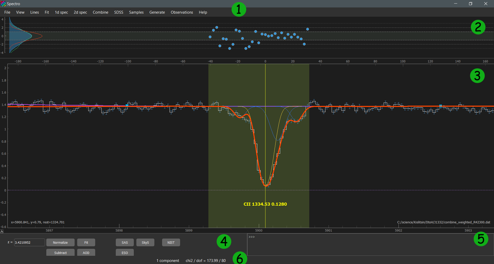

.. _gui:

Graphical User Interface
========================

**Spectro** package contains **sviewer** - the graphical user interface for the interactive spectral data analysis. It is located in the separate folder "sviewer" and 
should be loaded by running ``path/to/spectro/sviewer/__main__.py``, for example::

    $ path/to/python.exe path/to/spectro/sviewer/__main__.py

Alternatively, one can use convenient IDE to run the __main__.py, for example PyCharms, Spider, MScode, etc.

Main window
-----------
The main window of **sviewer** is typically looks like

where numbers highlight the following parts of GUI:

1. :ref:`main-menu`
#. :ref:`residuals-panel`
#. :ref:`spectrum-panel`   
#. :ref:`control-panel`
#. :ref:`console-gui`
#. :ref:`status-bar`

.. _main-menu:

Main menu
---------
For the detailed descriptions see see :ref:`Main menu`

.. _residuals-panel:

Residuals panel
--------------
It shows the residuals between spectrum and the fit model. It has shared x-axis with the Spectrum panel.  **Residuals panel** can be shown/hide by pressing ``F4`` or ``view/Residuals`` in the Main Menu. The blue area and green line in the left of this panel show the kde of the residual distribution, that is calculated using pixels from the whole spectrum and from the view window only, respectively. The red line shows the gaussian function with unit dispersion, that should be approaching in case of good fit. Note: that consistency between blue and red lines are not necessary means relaible fit, since you also need to control the structure in residuals. 

.. _spectrum-panel:

Spectrum panel
--------------
Tha main interactive window to work with the spectra. It shows the spectrum and the fit model and different graphical objects suitable for the spectral analysis. It is build on the base of `PlotWidget`_ class from the `pyqtgraph`_ package. The interaction process is quite essential, but the description of the main features of the interaction module can be find in the `pyqtgraph manual`_, for example `mouse interaction`_.

.. _pyqtgraph: https://www.pyqtgraph.org/
.. _mouse interaction: https://pyqtgraph.readthedocs.io/en/latest/mouse_interaction.html
.. _pyqtgraph manual: https://pyqtgraph.readthedocs.io/en/latest/index.html
.. _PlotWidget: https://pyqtgraph.readthedocs.io/en/latest/widgets/plotwidget.html?highlight=plotwidget

.. _control-panel:

Control panel
-------------

This panel contains some useful buttons for the spectral analysis, including:

1. **Redshift line edit field**: input the redshift for the line markers shown in Spectrum panel. The redshift also can be changed either by moving line markers ``SHIFT``+ drag or by using ``LEFT`` and ``RIGHT`` keys on the keyboard (and also with ``SHIFT+LEFT`` and ``SHIFT+RIGHT``).
#. **Normilize**: switch between normalized and raw views (where continuum is explicitly shown), i.e. NORMALIZED = I/I_0
#. **Substract**: switch between substacted and raw views, i.e. SUBSTARCTED = I-I_0
#. **AOD**: switch between aparent optical depth and raw views, i.e. AOD = np.ln(-I/I_0)
#. **Fit**: start the fit using LM minimization routine.
#. **SAS**: open spectrum in SDSS science archive server (only for SDSS spectra)
#. **SkyS**: open spectrum in SDSS sky server (only for SDSS spectra)
#. **ESO**: open spectrum in ESO data archive (**not avaliable yet**)
#. **NIST**: show the list of the possible lines avaliable in The NIST database which can be located within the ``Region`` object within Spectrum panel taking into account specified redshift.

.. _console-gui:

Console
-------
It allows to input commands moslty concerned with GUI management. For the detailed descriptions see :ref:`console`.

.. _status-bar:

Status bar
----------
Status bar shows some messages and indicate some useful numbers that are can be instructive during the fitting process, e.g. the number of the current fit component, chi^2/dof, etc
