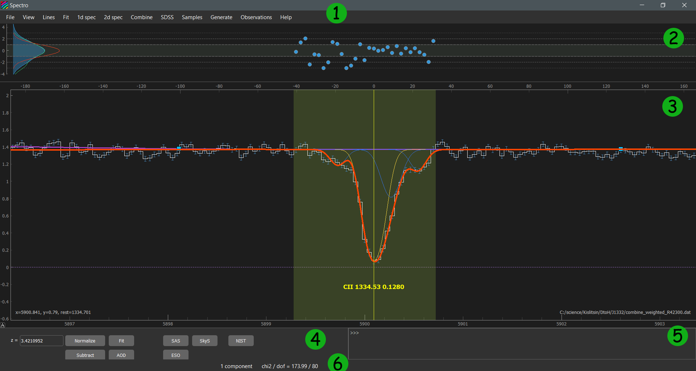

Graphical User Interface
========================

**Spectro** package contains **sviewer** - the graphical user interface for the interactive spectral data analysis. It is located in the separate folder "sviewer" and 
should be loaded by running ``sviewer/__main__.py``

    $ python sviewer/__main__.py

Main vindow
-----------
Next figure shows the view of the main window of **sviewer** subclass
