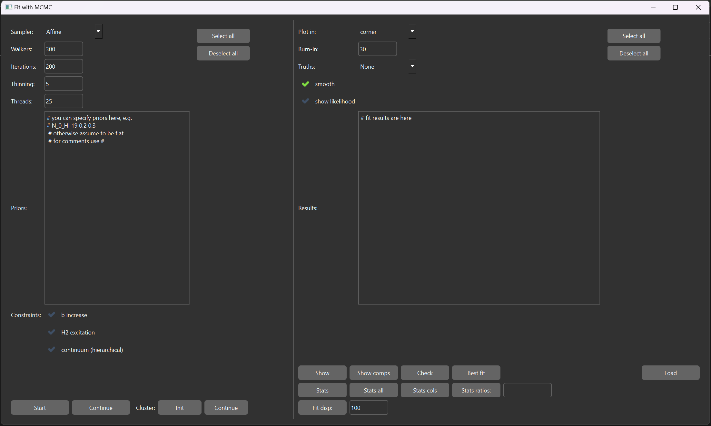

.. _mcmc:

Bayesian inference with MCMC
=============================

The code allows one to infer the posterior distribution function of the absorption model parameters using sampling of through Bayesian way.
The functionality of the code is still limited (e.g. regarding priors setup), but allow to perform full analysis, up to marginalized interval estimates, which is typically the main outcome.

MCMC widget
-----------

This widget provides the functionality to use Bayesian inference of the profile fitting parameters with different MCMC samplers.
The widget can be opened by pressing ``F5`` or using ``Fit/Fit MCMC...``. It is shown in the image below.
There are two group of the functions to run and to analyse the sampled posteriors, which are located in the left- and right-hand side of the Widget.

