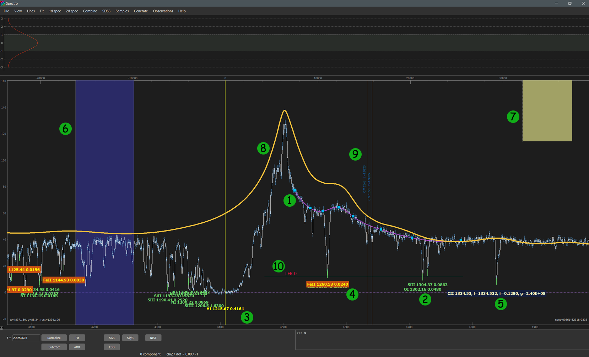

.. _objects:

Objects in GUI
==============

There are several interactive objects in the sviewer that can be move by mouse interaction to alleviate and speed up the spectral analysis. This objects are shown in this Figure and their description is given below

B-spline continuum
------------------

The continuum that is constructed using B-spline with the point choosed by holding **b** key (see :ref:`tutorial` and :ref:`keyboard`). It is marked as object 1 on the Figure.

Line labels
-----------

Line labels (objects 2, 3, 4, 5 in the figure) indicate possible positions of the absorption/emission lines corresponding to atomic/molacular transitions. The vertical position of the line label is tight to the spectrum, while the horizontal position can be changed either by moving line labels (using drag by mouse and keyboard) or by setting appropriate redshift in the redshift field in the :ref:`control-panel`. One can add/remove line labels using :ref:`console` commands: ``show <species>`` and ``hide <species>``. There are useful representations and interaction actions with line labels that ease the spectral analysis:

* ``SHIFT + DRAG``: move the line label by changing its redshift. 

* ``LEFT ARROW`` and ``RIGHT ARROW``: move the line label by changing its redshift.

* ``SHIFT + LEFT ARROW`` and ``SHIFT + RIGHT ARROW``: move with wider step.

* ``SHIFT + LEFT CLICK``: set line label as a reference line (see object 3), the top axis will be scaled with velocity offset from this line.

* ``CRTL + LEFT CLICK``: delete line label.

* ``h + LEFT CLICK``: highlight all line labels of the species (including level) that correspond to this line, similar to writing in the :ref:`console`: ``high <species>``. Highlighed line label is marked by object 4.

* ``ALT + LEFT CLICK``: show extended information about this line (see object 5).

Regions
-------

Regions (objects 6 and 7) are convinient graphical object to select certain wavelenght range of the spectrum. It can be used in several parts of the spectral analysis. There are two representation of the regions in extended (object 6) and minimized (object 7) form. Allowed interactions:

* **r + LEFT MOUSE BUTTON**:  create a region.

* **DOUBLE LEFT CLICK** on region: switch between extended and minimize representation.

* **SHIFT + LEFT MOUSE BUTTON**: modify (shift and changing size) the region

* **CTRL + LEFT CLICK**: delete region

Composite spectrum
------------------

Composite spectrum (object 8) indicate a composite spectrum of QSO. Currently, there are 3 types of the composite spectrum that is shown one after another. Interactions: 

* **CTRL + q**: show/hide composite spectrum.

* **SHIFT + DRAG**: drag composite spectrum, during this its normalization and redshift is changed.

* **CTRL + LEFT CLICK**: hide composite spectrum.

Doublet indicators
------------------

Doublet indicators (object 9) are separate line labels to mark the doublet absorption lines at the redshifts with distinct redshift as the main line labels (corresponding to the main redshift in the redshift panel). Interactions:

* **d + LEFT MOUSE BUTTON**: creat region. 

* **DOUBLE LEFT CLICK** on text label: highlight doublet.

* **SHIFT + LEFT MOUSE BUTTON** on text label: shift (change the redshift).

* **CTRL + LEFT MOUSE BUTTON** on text label: delete.

Line flux residuals (zero levels)
---------------------------------

Line flux residual (object 10) is the indicator of zero level, that can be a part of the fit profile constuction, to model the partial coverage. Interactions:

* **p + LEFT CLICK**: create line flux residual object.

* **SHIFT + LEFT MOUSE BUTTON** on text label: shift.

* **CTRL + LEFT MOUSE BUTTON** on text label: delete.

